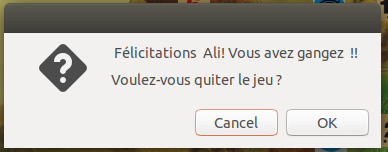

# Colons Game 

 

## Description 
 
Les Colons de Catane, Les Colons de Katäne, Catane ou Catan, est un jeu de société de Klaus Teuber, 

Un jeu de stratégie, avec une mécanique fluide et bien pensée. 

Le Nombre de joueurs pour ce jeu de société : de 2 à 6.  

Durée moyenne du jeu : 75 minutes. Jeu à partir de : 10 ans.  

Pour plus d'informations plus voir <a href="https://catanuniverse.com/fr" >appuyiez ici </a>. 

 
## GamePLay (Capture Video du jeu )

<a href="https://www.youtube.com/watch?v=qLEn7MC6Qcs"> Une capture video du jeu que j'ai developpé est disponible ici ici</a> . 

## Requirements 
  

- C++ 11  

- Une distribution d'un Système Linux est préférée (Ubuntu, Debian). 

 
 

## Compiler et lancer le jeu 
 

Le fichier makefile contient toutes les instructions essentielles pour compiler et lancer le jeu.  

    make clean && make && ./out ; 

 
 

Vous pouvez egalemet lancer directement  
 

    ./out 

 
 
 

## Organisation du projet  
 

 
 

<code>board_data_structures</code> ce dossier contient les classes utilisées dans le backend et qui stockent les données du tableau de bord comme les positions des tuiles, nœuds et routes ainsi que les contraintes des règles de jeu. 

 

<code>game</code> ce dossier comporte toutes les classes qui contrôlent la partie graphique du programme ainsi que d'autre classes intermédiaires entre le backend et le frontend comme board.cpp  

<b>Les prototypes des classes sont disponibles dans les deux fichiers <code>data_structures.h</code> et <code>header.h</code> </b> 

 

    ├── board_data_structures // les classes du tableau de bord (la map) 
    │ ├── data_structures.cpp  
    │ ├── data_structures.h  
    | 
    ├── data // les données : toutes les images utilisées 
    | 
    ├── game // les classes (partie graphique + gestion du jeu) 
    │ ├── board.cpp 
    │ ├── dessin.cpp 
    │ ├── Dice.cpp 
    │ ├── my_window.cpp // le gestion des tours ici 
    │ ├── player.cpp 
    │ ├── rules_win.cpp // fenetre rules 
    │ ├── thief_win.cpp // fenetre du voleur  
    │ ├── welcome_window.cpp // fenetre d'acceuil 
    | ├── header.h // les prototypes de la partie graphique+gestion du jeu 
    |  
    ├── Icon.png 
    ├── LICENSE 
    ├── main.cpp 
    ├── makefile 
    ├── README.md 
    ├── style.css  // du css pour le style

 
 
 
 

## Diagram de classes  
 
 

Ce diagramme UML donne une idée sur l'architecture générale du projet. Des informations plus en détails sur les méthodes et les attributs sont disponibles dans les fichiers <code> header.h</code> et <code> data_structure.h</code> .  

 
 
 

 

 
 

## Héritage  
 

### Classe abstraite  

Une classe abstraite <code>Map_element</code> a été utilisée, les deux classes <code>tuile</code> et <code>node</code> héritent de cette classe. 

### Classes de Gtkmm3  

Les classes my_window , rules_win ,welcome_window heritent de la classe de <code>GTk::WINDOW</code> de gtkmm3 .  

## Jeu  
 
Les mêmes règles ont été pris en compte dans notre jeu sauf quelques exceptions :  

- Le score finale requis pour gagner a été fixer à 5 (au lieu de 10) pour faciliter le test du jeu.  

- Les échanges entre les joueurs ainsi que la banque ne sont pas permis. 

- Le Voleur peut être activé déclenchant la perte de la moitié des cartes pour les joueurs possédant plus de 8 cartes. Mais ce dernier ne peut pas bouger (il reste figé dans les tuiles désertes du départ)  

 
 

<h2 style="color:red"> Remarque (Important) </h2>  

- Puisque ce jeu ne permet pas de faire les échanges entre joueur et avec banque, essayer SVP de placer vos premières colonies dans des intersections de façon à avoir accès à tous les ressources sinon le joueur ne pourra pas construire des maisons ou routes supplémentaires puisqu'il sera limiter par une ressource. (Pour tester le jeu) 

 
## Démo 

### 1/ Vidéo (DEMONSTRATION)  

### 2/ Choix du nombre de joueur 

La première fenêtre permet de choisir le nombre de joueur ainsi que leur noms. 
 

### 3/ Voleur

Le voleur est activé quand le dé retourne un 7. 
 

 

### 4/ Fenêtre de victoire  

Quand un  joueur attient le score 5 (5 maisons ). Une fenêtre dialogue s'affiche annonçant le joueur qui a gagné et demandant aux joueurs s'ils veulent continuer le jeu ou quitter.  

 

 
 

 

 

 

 